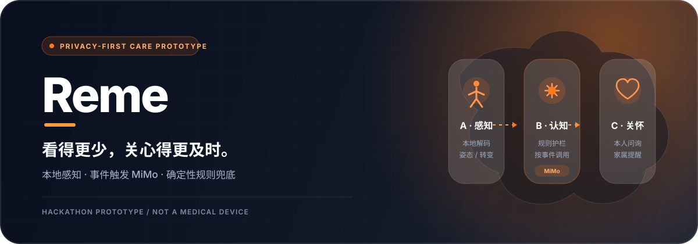
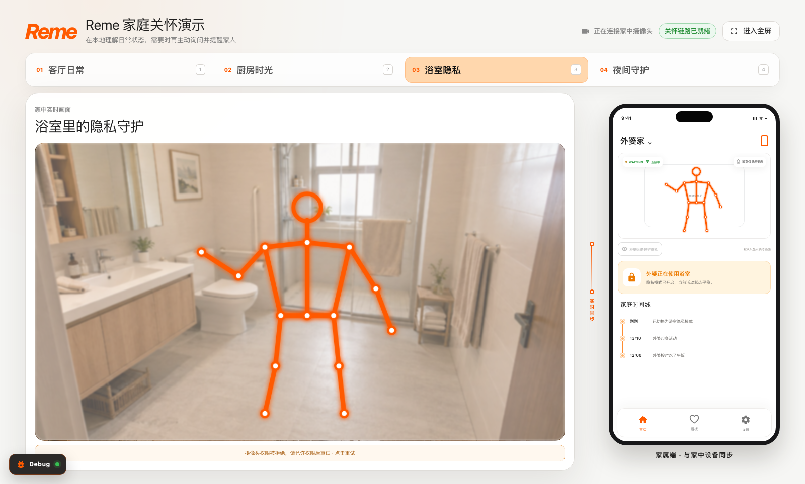
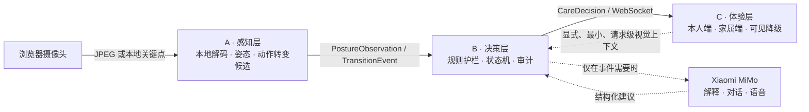

<p align="center">
  
</p>

<p align="center">
  
  
  
  
  
</p>

<p align="center">
  面向独居或独处长者的隐私优先主动关怀原型。<br />
  Reme 在本地把摄像头输入转换为姿态与动作转变候选，只在需要解释、沟通或补充视觉依据时按事件调用 MiMo，
  再把值得关注的变化转化为本人问询和家属端提醒。
</p>

> [!IMPORTANT]
> Reme 是黑客松阶段的技术原型，不是医疗设备，不提供诊断、可靠跌倒检测保证或外部急救调度。
> 本项目中的“告警”仅指向家属端发送提醒。

<p align="center">
  
  <br />
  <sub>ABC 本地验收界面 · 无摄像头权限时的动态骨架演示；时间线为静态演示文案，不作为识别或准确率证据</sub>
</p>

## 为什么是 Reme

| 看得更少 | 先问本人 | 规则兜底 |
|---|---|---|
| 摄像头输入在本地解码；界面支持骨架或强抽象视图，浴室场景强制只保留骨架。 | 面对可能需要帮助的变化，先向本人发起简短问询，避免把每次异常都直接定性。 | 安全升级由确定性状态机控制；MiMo 可以组织表达，但不能取消、降低或延迟规则升级。 |

核心原则可以概括为：**dialogue is model-shaped; escalation is rule-shaped.**

## 系统如何工作



- **A · 感知层**：管理运行时会话，接收浏览器摄像头或关键点流，产生实验性的姿态观察与动作转变候选。
- **B · 决策层**：通过规则、风险下限和状态机决定问询或家属提醒；MiMo 只在事件需要自然语言或额外推理时参与。
- **C · 体验层**：在同一验收页展示家中端与家属端，明确呈现骨架、倒计时、降级状态和处理回执。

## 四个演示场景

| 场景 | 当前演示内容 | 事实边界 |
|---|---|---|
| 客厅日常 | 摄像头输入、姿态视图与平稳状态；可手动发起主动问候。 | 不把正常活动包装成身份、情绪或意图识别。 |
| 厨房时光 | 进入预置厨房场景后，由 MiMo 发起“是否分享”对话；本人同意后家属端收到生活提醒。 | 当前是预置场景上下文，不是已验证的做饭活动识别。 |
| 浴室隐私 | 家属端强制保留骨架/抽象视图，不开放现场原画。 | 隐私模式改变呈现方式，不改变感知结果本身。 |
| 夜间守护 | 跌倒式动作候选或明确标注的手动演示触发问询；无回应后由规则提醒家属。 | 候选不等于临床结论，也不呼叫外部急救服务。 |

## 隐私边界

“本地处理”不等于“像素从未被处理”，也不等于所有云端推理都无视觉输入。Reme 当前按下列边界约束设计；其中危险确认视觉支路的 `visual_sent` 审计标志和 UI 发送结果仍待修复，不能把现有日志当作完整的端到端视觉审计证据：

| 环节 | 当前约束 |
|---|---|
| 感知 | 原始输入在本地解码；不额外导出原始帧文件，除非显式启用调试。 |
| 结构化路径 | 姿态观察、动作转变候选和关怀决策可以独立流转，不要求持续上传原始视频。 |
| MiMo 视觉上下文 | 设计要求是：仅当视觉信息确实有助于判断时，显式发送最少的关键帧或短片；按请求发生，而不是后台连续上传。当前 `main` 尚未准确记录危险确认支路的视觉发送标志。 |
| 家属/评委呈现 | 浴室场景强制为骨架视图。当前 `main` 的客厅、厨房和夜间演示仍允许家属侧显示现场画面，厨房与夜间部分状态会自动打开；这是待收口的演示隐私缺口，不代表生产授权边界。 |
| 留存 | 本地应用在请求后默认不保留额外原始帧/短片；生产环境的同意、加密、访问控制、保留期及服务商侧策略不属于本原型结论。 |

更多背景见 [CONTEXT.md](CONTEXT.md) 与 [ADR-0003](docs/adr/0003-allow-minimal-visual-context-to-mimo.md)。

## 快速开始

### 环境要求

- Python 3.11+（项目开发环境使用 Python 3.12）
- [uv](https://docs.astral.sh/uv/)
- Node.js 20.19+、22.13+ 或 24+
- 支持摄像头权限的现代浏览器

### 一条链路启动 A + B + C

```bash
uv sync --extra dev
npm --prefix frontend ci

# 可选：配置 MiMo key；key 写入仓库外的 ~/.config/reme/mimo.env
scripts/setup-mimo-env.sh

uv run reme-local-demo
```

打开 `http://127.0.0.1:4174/typical-demo.html` 并允许摄像头权限。启动器会统一管理：

| 组件 | 默认地址 | 职责 |
|---|---|---|
| A · Perception | `http://127.0.0.1:8770` | 浏览器输入、姿态与动作转变候选 |
| B · Decision | `http://127.0.0.1:8100` | 规则/MiMo 决策与事件流 |
| C · Experience | `http://127.0.0.1:4174` | React 双端验收页面 |

MiMo key 不是启动硬依赖：没有 key 时，确定性问询、倒计时与家属提醒仍可运行，模型路径会显示降级。默认 `auto` 模式可以使用浏览器 MediaPipe 关键点路径。后端 MoveNet/JPEG 路径还需要 `uv sync --extra dev --extra pose`、Git 忽略目录中的已验证模型/分类器资产，并应在 `/api/runtime/capabilities` 中确认实际选中了 JPEG lane；详见[姿态与转变实验说明](backend/reme/pose/README.md)。

完整操作与排障说明见 [快速启动指南](docs/%E5%BF%AB%E9%80%9F%E5%90%AF%E5%8A%A8.md)。

## 本地验证

后端质量门：

```bash
uv run pytest
uv run ruff check .
uv run mypy
```

前端质量门：

```bash
npm --prefix frontend test
npm --prefix frontend run lint
npm --prefix frontend run build
```

仓库当前没有配置 GitLab CI，因此首屏不展示虚构的 pipeline 或 coverage 徽章。

## 项目结构

```text
.
├── backend/reme/          # A 感知、B 决策与本地编排
├── frontend/              # C 端 React 演示与本地模型资产
├── tests/                 # 确定性领域逻辑与链路测试
├── examples/              # 可复现事件、决策与联调样例
├── docs/
│   ├── adr/               # 已接受、拒绝或被取代的架构决策
│   └── references/        # 证据台账与信息来源
├── .scratch/              # 可行性协议、实验记录与工作项
├── CONTEXT.md             # 当前产品语言、事实边界与开放问题
└── pyproject.toml         # Python 包、CLI 与质量门配置
```

`src/reme/` 是早期 motion-data tracer bullet 的历史代码；实际构建、测试与类型检查以 `backend/reme/` 为准。

## 当前边界

已实现的是一个**单人、单机、比赛级原型**：

- 有明确的 A/B/C 接缝、运行时事件与可见降级状态；
- 有本地摄像头路径、骨架/场景化呈现、事件触发 MiMo 与确定性升级链；
- 有可重复的手动演示入口，现场能力与脚本能力应始终分开标注。

尚未承诺：

- 医疗诊断、保证跌倒检测或任何未经标注集验证的准确率；
- 多人、多房间、身份/情绪识别或真实智能家居平台接入；
- Raspberry Pi 性能、生产安全、合规认证或服务商侧零留存；
- 当前实验合同、阈值或模型已经成为永久产品架构。

## 文档入口

- [领域上下文与开放问题](CONTEXT.md)
- [ABC 单机快速启动](docs/%E5%BF%AB%E9%80%9F%E5%90%AF%E5%8A%A8.md)
- [姿态与转变实验说明](backend/reme/pose/README.md)
- [最小视觉上下文 ADR](docs/adr/0003-allow-minimal-visual-context-to-mimo.md)
- [先问本人、规则升级 ADR](docs/adr/0005-check-in-first-deterministic-escalation.md)
- [危险时期快速确认 ADR](docs/adr/0007-danger-fast-confirm-link.md)

## 团队

Reme 由四人团队为第七届小米集团黑客马拉松 · 高校赛道 · Xiaomi MiMo 竞赛单元共同构建：

| 成员 | 主要职责 |
|---|---|
| 李栋 | 队长 / 产品 |
| 谭朗 | 技术负责 |
| 梁博星 | 姿态识别 / UI |
| 江婷芳 | 家属端 / 视频 |

## License

Proprietary. 本仓库为比赛项目，未经许可不得复制、分发或用于生产部署。
